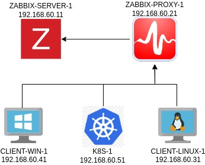

# Monitoring-IT-Components-with-Zabbix

This repository contains the required code to create the lab enviroment of the course **Monitoring IT Components with Zabbix**.

It is expect to deploy the environment, according:



# Prerequisites

In order to run this environment it is necessary the minimum of `8GB RAM`, but it is recommended `16GB RAM`, according current resources designed to each VM:

| VM | vCPU | Mem (MB) |
| -- | :--: | -------: |
| ZABBIX-SERVER-1 | 2 | 1024 |
| ZABBIX-PROXY-1 | 2 | 512 |
| CLIENT-WIN-1 | 1 | 384 |
| CLIENT-LINUX-1 | 1 | 384 |
| K8S-1 | 4 | 1536 |  
|

You can modify the settings of each VM on [Vagrantfile](Vagrantfile), according:
- [Name of VM]_CPU: Number of vCPUs
- [Name of VM]_Memory: Amount of memory in MB

# Setup your machine

This topic is designed to drive you throught the process to setup your machine, in order to install properly requirements, that will run the creation process of VMs.

***Please follow the steps described in this topic before proceed.***

## Vagrant
The Virtual machines are designed to be created by [Vagrant](https://www.vagrantup.com/), that is possible to run on Windows, Linux or MacOS, please check [this link](https://www.vagrantup.com/downloads), and then follow the procedure to install in the platform you are running.

Also, it will be necessary to define [Vagrant Provider](https://www.vagrantup.com/docs/providers), that is basically the hypersor to manage your VMs, there are multiple options, like [VirtualBox](https://www.virtualbox.org/), [Hyper-V](https://en.wikipedia.org/wiki/Hyper-V), [VMWare](https://www.vmware.com/) and even [Docker](https://www.docker.com/) is supported. The current setup is using the provider [Libvirt](https://github.com/vagrant-libvirt/vagrant-libvirt), that is defined on [Vagrantfile](Vagrantfile) by the variable `PROVIDER`, that uses [KVM](https://www.linux-kvm.org/page/Main_Page) as provider driver, that is defined in the variable `PROVIDER_DRIVER`.

***In case you want to use any different provider, just set variables described above on your [Vagrantfile](Vagrantfile).***

## Ansible

In order to execute the automation of the virtual machines, [Ansible](https://www.ansible.com/) is integrated with Vagrant by [Ansible provisioner](https://www.vagrantup.com/docs/provisioning/ansible), therefore, it is necessary to [install ansible](https://docs.ansible.com/ansible/latest/installation_guide/intro_installation.html) on your machine.

In order to complete this step, please follow the steps described on article [Installing Ansible on specific operating systems](https://docs.ansible.com/ansible/latest/installation_guide/installation_distros.html).

After the installation, it is also necessary to install the plugins `zabbix-api`, `community.zabbix` and `kubernetes.core`, according:

```
$ pip install zabbix-api
$ ansible-galaxy collection install community.zabbix
$ ansible-galaxy collection install kubernetes.core
```

# Create the lab environment

***Please remember to complete the steps of previous topics before.***

You can create your lab environment direct by Vagrant, according:

Get status of VMs

```
$ vagrant status
Current machine states:

zabbix-server-1           running (libvirt)
zabbix-proxy-1            running (libvirt)
client-linux-1            not created (libvirt)
client-win-1              not created (libvirt)
k8s-1                     running (libvirt)

This environment represents multiple VMs. The VMs are all listed
above with their current state. For more information about a specific
VM, run `vagrant status NAME`.

```
Create all the enviroment
This process can take while during the first execution, because requires the download of [vagrant boxes](https://www.vagrantup.com/docs/boxes), besides complete the automation of all VMs.
```
$ vagrant up --no-parallel
```


# Reach lab environment components

## SSH Linux VMs
In order to the Linux VMs, you can do it via `ssh`, just running the command `vagrant ssh [name of vm]`, according example:

```
$ vagrant ssh k8s-1
Last login: Sun Oct  2 17:46:58 2022 from 192.168.121.1
vagrant@k8s-1:~$ 
```

## Reach Zabbix Server Web UI

The Zabbix server is reachable by url [http://192.168.60.11:8080/](http://192.168.60.11:8080/), just providing the credentials:
- User: `Admin`
- Password: `zabbix`

## Reach Grafana instance

In order to complete some laboratories, it was deployed also a [Grafana](https://grafana.com/) instance, that is reachable by url [http://192.168.60.51:30080/login](http://192.168.60.51:30080/login).

The credentials are provided during the deployment of vm `k8s-1`, in case you did not took note during the deployment, you can get the `password` just running the command `vagrant provision k8s-1`, according:

```
$ vagrant provision k8s-1
TASK [k8s : Get Grafana Password] **********************************************
changed: [k8s-1]

TASK [k8s : Show Grafana Password] *********************************************
ok: [k8s-1] => {
    "msg": "Grafana Password: Ffo9FAJpF5USh91ER6XT1LJYUucWr6OcIzjRDKIt"
}

PLAY RECAP *********************************************************************
k8s-1                      : ok=29   changed=5    unreachable=0    failed=0    skipped=14   rescued=0    ignored=0 
```

After get the password, you can login on Grafana using the credentials:
- User: `admin`
- Password: Value from `vagrant provision k8s-1`